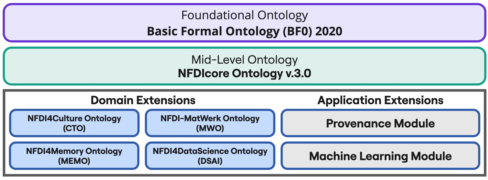

# Modular Extensions

To meet the specific needs of individual domains, NFDIcore is designed to be extended by domain and application ontologies. These ontologies build upon NFDIcore's shared structure while providing the expressivity required for their respective communities. In regular community exchanges, it is evaluated which concepts from domain-specific extensions are suitable to be represented as part of the shared mid-level layer and which elements remain domain and function specific. Any consortium and domain is welcome to provide their own extension to NFDIcore. To get in touch about the creation of a new extension, please contact [Tabea Tietz](mailto:tabea.tietz@fiz-karlsruhe.de). The currently published extensions are listed below.  

## NFDI-MatWerk Ontology (MWO) 

* MWO captures key aspects of MSE research data, including community structures, projects, resources, and services within NFDI-MatWerk. It provides the foundation for the [MSE Knowledge Graph](https://nfdi.fiz-karlsruhe.de/matwerk/), enabling efficient data integration and retrieval, and supporting collaboration and knowledge representation across materials science and engineering.
* Current version: [3.0](https://github.com/ISE-FIZKarlsruhe/mwo/releases/tag/v3.0.0)
* [MWO documentation](https://ise-fizkarlsruhe.github.io/mwo/docs)
* Contact person: [Hossein Beygi Nasrabadi](mailto:hossein.beygi_nasrabadi@fiz-karlsruhe.de)

## NFDI4Culture Ontology (CTO) 

* CTO represents the research data of the NFDI4Culture community within a centralized research data index, providing a single point of access to decentralized cultural heritage research resources. The ontology enables the integration of research (meta)data into the [NFDI4Culture Knowledge Graph](https://nfdi4culture.de/resources/knowledge-graph.html) and, consequently, the [NFDI4Culture Information Portal](https://nfdi4culture.de/). 
* Current version: [3.0](https://github.com/ISE-FIZKarlsruhe/nfdi4culture/releases/tag/v3.0.0) 
* [CTO documentation](https://nfdi.fiz-karlsruhe.de/4culture/)
* Contact person: [Tabea Tietz](mailto:tabea.tietz@fiz-karlsruhe.de)  

## NFDI4Memory Ontology (MEMO) 

* MemO represents domain-specific concepts from the historical sciences, focusing on metadata harmonization and detailed provenance representation. It forms the basis of the [NFDI4Memory Knowledge Graph](https://nfdi.fiz-karlsruhe.de/4memory/), which serves as a central index for research data, institutions, researchers, and services.
* Current version: [1.0](https://nfdi.fiz-karlsruhe.de/4memory/ontology/1.0.0)
* [MemO documentation](https://nfdi.fiz-karlsruhe.de/4memory/ontology/)
* Contact person: [Sarah Rebecca Ondraszek](mailto:sarah-rebecca.ondraszek@fiz-karlsruhe.de) 

## NFDI4DataScience Ontology (DSO) 

* The vision of NFDI4DataScience (DSAI) is to support all steps of the complex and interdisciplinary research data lifecycle in Data Science and Artificial Intelligence. 
* Current Version: [1.0](https://nfdi.fiz-karlsruhe.de/nfdi4dso/1.0.0) 
* [DSAI documentation](https://ise-fizkarlsruhe.github.io/NFDI4DS-Ontology/)
* Contact person: [Genet Asefa Gesese](mailto:genet-asefa.gesese@fiz-karlsruhe.de) 

