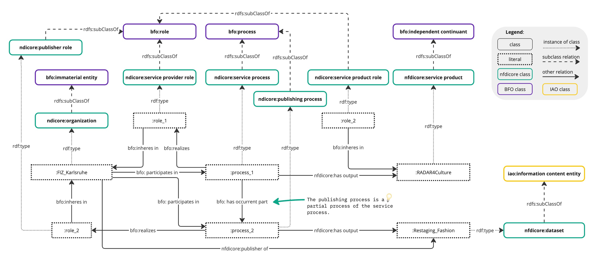
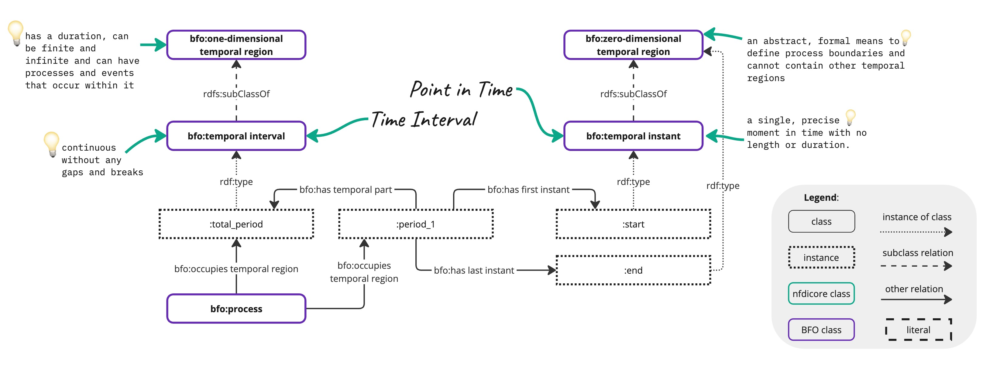

# Ontology

The NFDI Ontology is a mid-level ontology designed to represent both the organizational structure of the Nationale Forschungsdateninfrastruktur (NFDI) and the diverse datasets provided by NFDI project partners.

## Overview

The ontology provides a shared vocabulary and a consistent framework that supports data management, integration, and interoperability across a wide range of disciplines. Below is an overview of key concepts within the ontology. The complete list of concepts can be found in the generated ontology description: [https://nfdi.fiz-karlsruhe.de/ontology/](https://nfdi.fiz-karlsruhe.de/ontology/).

### Key Concepts

#### Organizational 
- **Organization**: Represents institutions, research groups, or companies involved in NFDI activities.
- **Person**: An individual, such as a researcher or contributor, participating in NFDI projects.
- **Consortium**: Represents collaborative groups formed by multiple organizations within the NFDI.
- **ConsortiumMember**: A participant within a consortium, whether an organization or person.
- **ConsortiumMemberRole**: Defines the roles played by members within a consortium, such as "lead partner" or "contributor"
- **Project**: Represents individual research projects or initiatives within the NFDI ecosystem.

#### Research and Academic
- **AcademicDiscipline**: Categories representing different fields of study or research disciplines.
- **Publication**: Scholarly works or research reports published as a result of NFDI projects.
- **Contributing**: Represents contributions made by people or organizations to a project or dataset.
- **Event**: Represents events such as conferences, workshops, or meetings organized by NFDI or related entities.

#### Geographical
- **City**: Represents cities related to projects, events, or organizational locations.
- **Country**: Countries where NFDI organizations or research activities are based.
- **FederalState**: States or provinces within a country, relevant to the localization of activities or organizations.
- **Place**: A more general class representing any location such as cities, countries, or regions.

#### Data and Information
- **Dataset**: Structured collections of data produced or managed by NFDI partners.
- **Data Portal**: Digital platforms or repositories where datasets are stored and accessed.
- **Collection**: Represents grouped resources, such as datasets, publications, or software.
- **CreativeWork**: Any intellectual output, including publications, datasets, software, or media.

#### Technology and Standards
- **Software**: Represents software tools or applications developed and used within the NFDI.
- **Programming Language**: Programming languages used in developing software or tools.
- **Specification**: Defines technical specifications related to datasets, software, or services.
- **Standard**: Represents standards followed for data management, storage, and dissemination.
- **Technological Method Specification**: A technological method employed for the creation, management, utilization, or control of a digital resource.
- **Ontology**: Formalized structures of knowledge representation, including the NFDI Ontology itself.

#### NFDI Resource and Service
- **NFDI Resource**: General class for any entity utilized within the NFDI framework, such as datasets or software.
- **Service Process**: Organizes activities and resources to deliver a specific service, ensuring its efficiency, reliability, and alignment with intended goals.
- **Service Product**: Provides value through a service offering, delivering intangible benefits or functionality designed to fulfill specific needs or requirements in a structured process.
- **License**: Represents the legal terms under which datasets, publications, or software are made available.
- **Website**: Represents websites or web services associated with NFDI partners or projects.

#### Formats
- **MIME-Type**: Serves as a standardized identifier for specifying the nature and format of data.
- **Export Format Specification**: Defines the structural, syntactic, and encoding rules for representing data when it is exported from a system.

## NFDI Resources

Within NFDIcore, resources are continuants which encompass a wide range of digital creative works, including datasets, collections, and metadata, as well as offered products and services such as data portals, data curation, and data digitization.  
 

NFDI resources can be associated with academic disciplines (nfdicore:academic discipline, NFDI_0000100) allowing for a more nuanced understanding of their context and relevance. 
 

## Agents

Likewise, in NFDIcore, the concept of Agents extends to both organizations and persons, serving as independent continuants within the BFO ontology. Agents are essential for management of research data resources, and include entities such as research institutions, consortia, universities, companies, and individual researchers or data scientists. 

Within NFDIcore, agents can be directly linked to resources via different relations; may participate in processes (BFO_0000015) and be associated with diverse roles (BFO_0000023), e.g. nfdicore:publisher role (NFDI_0000193), nfdicore:contributor role (NFDI_0000118), etc. within the processes. Moreover, agents engage in diverse relationships with other agents, e.g. nfdicore:partner organization (NFDI_0000182). 

Resources within NFDIcore engage in diverse relationships with agents, facilitated by various properties such as nfdicore:contributor, nfdicore:publisher, and nfdicore:contactPoint. While these properties enable direct connections between agents and resources, they may lack some expressivity. In scenarios requiring more detailed semantics to describe the relationship between an agent and a resource, the modeling proposed by BFO 2020 can be employed.  

## Processes, Events and Time

A process (BFO_0000015) can encompass subordinate processes and partial processes. Within NFDIcore, a process often serves to establish connections between agents and information content entities (IAO_0000030), defining the roles (BFO_0000023) of agents with respect to the involved information content entities. 

The bfo:temporal region (BFO_0000008) is an occurrent and is used to represent the structure of time. Thereby, the bfo:zero-dimensional temporal region (BFO_0000148) represents a single instant in time, a precise point in time without any duration, e.g. the date when the NFDI Verein was founded (nfdicore:act of foundation, NFDI_0001020). In contrast, the one-dimensional temporal region (BFO_0000038) refers to a time interval which has a duration, can be finite as well as infinite and events can occur within it. 

The nfdicore:event (NFDI_0000131) is associated with processes that represent an organized happening that unfolds in time. The nfdicore:event, classified as an occurrent (BFO_0000003), serves as a representation for various happenings such as conferences, and workshops.

