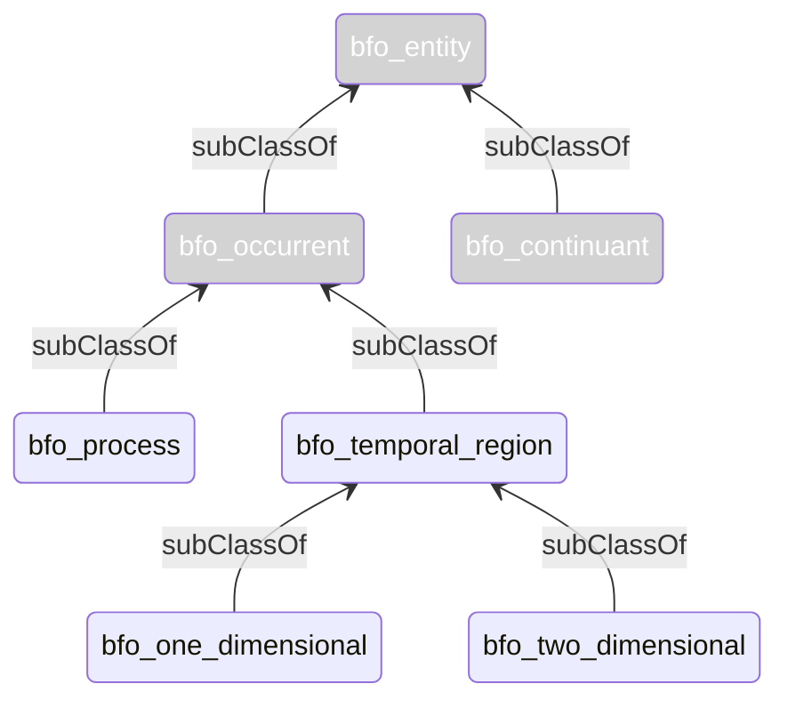

# Usage Patterns

In this section usage patterns and A-Box examples are introduced.

## NFDI Resources

Within NFDIcore, resources are continuants which encompass a wide range of digital creative works, including datasets, collections, and metadata, as well as offered products and services such as data portals, data curation, and data digitization.  
 

NFDI resources can be associated with academic disciplines (nfdicore:academic discipline, NFDI_0000100) allowing for a more nuanced understanding of their context and relevance. 
 

## Agents

Likewise, in NFDIcore, the concept of Agents extends to both organizations and persons, serving as independent continuants within the BFO ontology. Agents are essential for management of research data resources, and include entities such as research institutions, consortia, universities, companies, and individual researchers or data scientists. 

Within NFDIcore, agents can be directly linked to resources via different relations; may participate in processes (BFO_0000015) and be associated with diverse roles (BFO_0000023), e.g. nfdicore:publisher role (NFDI_0000193), nfdicore:contributor role (NFDI_0000118), etc. within the processes. Moreover, agents engage in diverse relationships with other agents, e.g. nfdicore:parent organization (NFDI_0000182). 

Resources within NFDIcore engage in diverse relationships with agents, facilitated by various properties such as nfdicore:contributor, nfdicore:creator, nfdicore:publisher, and nfdicore:contactPoint. While these properties enable direct connections between agents and resources, they may lack some expressivity. E.g. additional information about the relationship like a temporal context, ordering (e.g. for authors). In scenarios requiring more detailed semantics to describe the relationship between an agent and a resource, the modeling proposed by BFO 2020 with processes and roles can be employed.  

## Processes

A process (BFO_0000015) can encompass subordinate processes and partial processes. Within NFDIcore, a process often serves to establish connections between agents and information content entities (IAO_0000030), defining the roles (BFO_0000023) of agents with respect to the involved information content entities. 

## Events and Time 

The bfo:temporal region (BFO_0000008) is an occurrent and is used to represent the structure of time. Thereby, the bfo:zero-dimensional temporal region (BFO_0000148) represents a single instant in time, a precise point in time without any duration, e.g. the date when the NFDI Verein was founded (nfdicore:act of foundation, NFDI_0001020). In contrast, the one-dimensional temporal region (BFO_0000038) refers to a time interval which has a duration, can be finite as well as infinite and events can occur within it. 

The nfdicore:event (NFDI_0000131) is associated with processes that represent an organized happening that unfolds in time. The nfdicore:event, classified as an occurrent (BFO_0000003), serves as a representation for various happenings such as conferences, and workshops.

